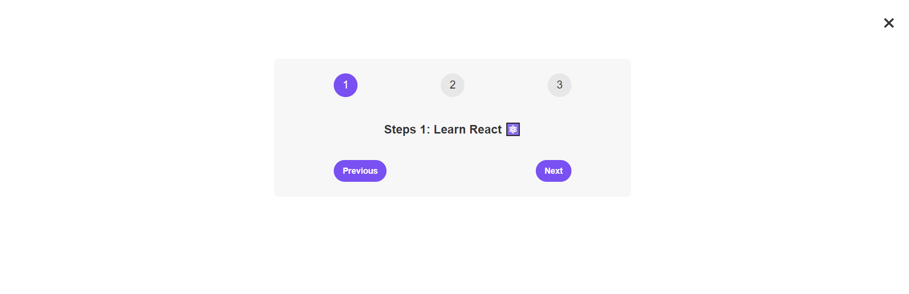

# 🎲 Steps

[Visitez le site en ligne]()

Date de début du projet : 15/02/2024

Date de fin du projet : 16/02/2024

Ce projet a été réalisé dans le cadre de l'exercice sur les States et les Events en React. Il permet à l'utilisateur de sélectionner des numéros de 1 à 3 et affiche un message correspondant au numéro sélectionné. De plus, il comprend deux boutons, "Next" et "Previous", pour passer au numéro suivant ou précédent respectivement.

## Fonctionnalités

- Affichage de trois chiffres sur la page.
- En cliquant sur l'un des chiffres, différents messages apparaissent en fonction du chiffre sélectionné.

## Technologies Utilisées

- React
- HTML/CSS

## Déploiement

Le projet est déployé sur GitHub Pages à l'adresse suivante : [Lien vers le déploiement]()

## Instructions de développement

## Instructions de développement

1. Clonez le dépôt GitHub sur votre machine locale.
2. Assurez-vous d'avoir Node.js installé sur votre machine.
3. Installez les dépendances en exécutant `npm install`.
4. Lancez l'application en exécutant `npm start`.
5. Développez et testez votre application en modifiant les fichiers dans le dossier src.

## Auteur

Ce projet a été développé par [Loa Gnadjou SOUMAHORO](https://github.com/LoaGnadjouSoumahoro).
