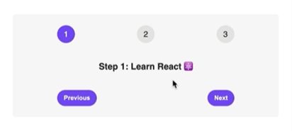

#🎲 Steps
Date de début du projet : 15/02/2024

<!-- Date de fin du projet : -->

Ce projet en React vise à pratiquer l'utilisation du State et des Events. Il consiste en une page affichant trois chiffres. En cliquant sur l'un des chiffres, différents messages apparaissent.

## Fonctionnalités

- Affichage de trois chiffres sur la page.
- En cliquant sur l'un des chiffres, différents messages apparaissent en fonction du chiffre sélectionné.
